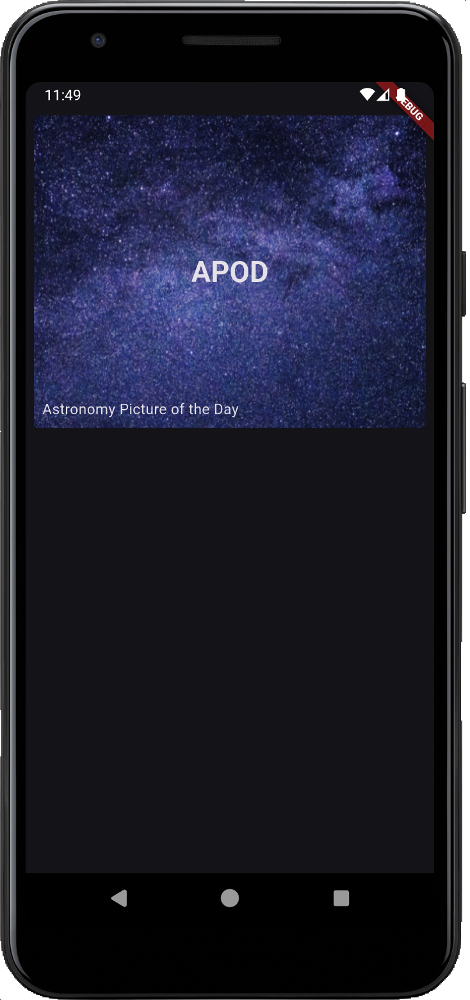
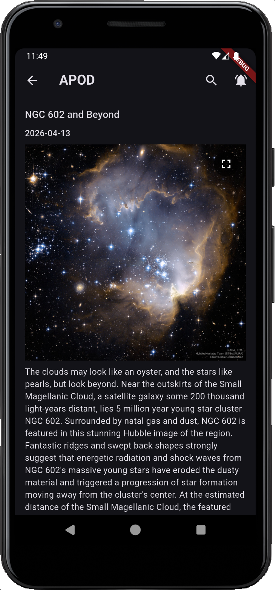
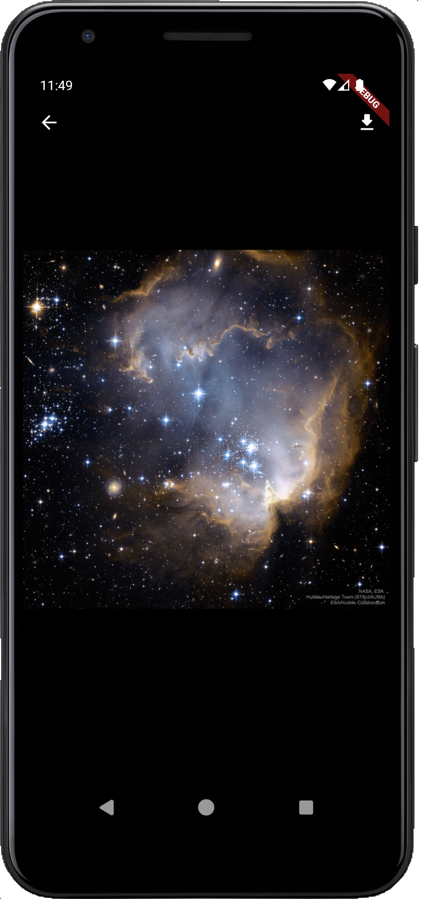
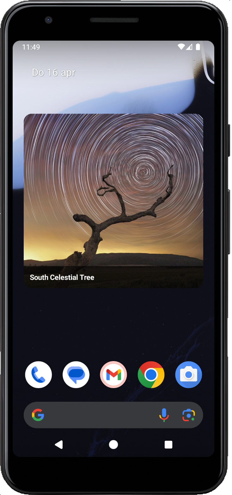

# Cosmos App

An app about space and astronomy built with Flutter, created to experiment with Home widgets an as a personal tool that feeds my passion for space and space exploration.

## Screens

### Home
The home screen is a tile design that displays all the available API's and features the app facilitates. At the moment only NASA's APOD api is implemented in the app. There are many more features on the roadmap. Stay tuned!

### APOD
The APOD screen features the visualization of one of NASA's most popular public API's: [Astronomy Picture Of the Day](https://github.com/nasa/apod-api). The api features a astronomy releated image or video on a daily basis. The feature in this app displays the APOD of the day, and the user has the option to search the APOD on a specific day by tapping the search icon in the appbar. 

The user also has the option to enable a daily reminder to view today's APOD.

### APOD detail
In the detail screen (if the APOD is an image), the user can see the image full screen, can zoom in and optionally download the image. 

### The home widget
The app was originally created to experiment with the flutter plugin: [home_widget](https://pub.dev/packages/home_widget). A home widget on Android is a small, interactive application view that can be embedded on your device's home screen. Widgets provide quick access to specific app functions or information without needing to open the full app. The Cosmos app has one home widget implemented that shows the APOD of the day in case it is an image (and not a video).

### Support free apps! 
If you like it, please consider buying me a coffee.

